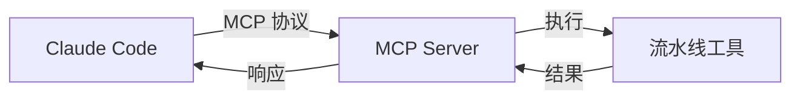
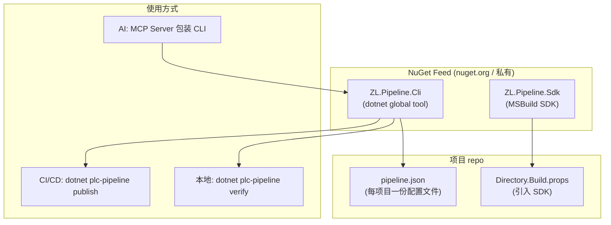

# 工程化治理方案：集中式发布流水线工具链

## 背景

当前两个项目（ZL.PlcBase、ZL.PlcSimulator）各自独立复制了一份构建→混淆→发布脚本：

| 脚本 | ZL.PlcBase | ZL.PlcSimulator | 差异 |
|------|-----------|----------------|------|
| `release-verify.sh` | ✅ 定制版 | ✅ 定制版 | 80% 相同，20% 硬编码（项目名、路径、版本） |
| `replace-nupkg-dll.py` | ✅ 复制版 | ✅ 复制版 | **完全相同，无需定制** |
| `api-compare.py` | ✅ 复制版 | ✅ 复制版 | **完全相同，无需定制** |
| `verify-nuget-obfuscation.sh` | ✅ 复制版 | ✅ 复制版 | **完全相同，无需定制** |

**问题**：扩展到 15-20+ 个项目时，每修复一个脚本 bug 就要手动同步到所有项目，不可持续。

## 需求分析

### 核心约束

| 维度 | 要求 |
|------|------|
| **不可绕过** | 不能出现"手动 dotnet nuget push 跳过混淆"的情况 |
| **一致性** | 所有项目使用相同流水线逻辑，一改全改 |
| **低门槛** | 新项目 5 分钟内接入，无需理解流水线内部细节 |
| **CI/CD 友好** | GitHub Actions 中直接调用，不依赖 AI Agent |
| **可审计** | 每次发布有完整日志：API 对比报告、混淆统计、SHA256 |

### 流水线步骤（不可变）

```
build → pack → publish(依赖集) → obfuscate → replace-dll → api-compare → verify-nuget → push
  1       2          3               4             5             6            7        8
```

每一步的输出是下一步的输入，中间任一环节失败则中止。

## 三种方案分析

### 方案 A：Claude Code Skills（❌ 不适合作为核心方案）

**原理**：在 `.atomcode/skills/` 中定义可复用的提示模板，Claude Code 加载后按指引操作。

```
.atomcode/skills/release-pipeline/SKILL.md
  ↓ Claude Code 阅读
  ↓ 按步骤在终端执行命令
```

**优点**：
- 创建成本低（写一个 Markdown 文件）
- 跨项目共享（通过 `.atomcode/` 或全局 skills）

**致命缺陷**：
| 缺陷 | 严重度 |
|------|--------|
| **依赖 AI Agent** | 🔴 没有 Claude Code 就不能发版 |
| **可绕过** | 🔴 开发者可以"不用 Skill，直接敲命令" |
| **非确定性** | 🟡 不同模型生成不同命令 |
| **CI/CD 无法集成** | 🔴 CI 环境没有 Claude Code |
| **逻辑分散** | 🟡 提示模板无法保证脚本版本一致性 |

**结论**：❌ 不适合作为流水线核心载体。适合作为 **AI 辅助的配置向导**（指导开发者如何配置项目接入工具链），但**不适合承载确定性的发布逻辑**。

---

### 方案 B：MCP 服务器（⚠️ 部分适合）

**原理**：通过 MCP 协议暴露工具接口，Claude Code 可直接调用工具完成操作。



**优点**：
- 工具接口标准化（输入/输出协议固定）
- 逻辑集中在 MCP Server 一处维护
- Claude Code 与 MCP Server 解耦

**仍然存在的问题**：

| 问题 | 说明 |
|------|------|
| 🔴 **仍依赖 AI Agent** | 没有 Claude Code 就无法触发发布 |
| 🔴 **CI/CD 无法直接使用** | GitHub Actions 不能调用 MCP 协议 |
| 🟡 **额外运维成本** | 需要部署 / 守护 MCP Server 进程 |

**最佳定位**：MCP **可以作为工具链的"AI 接口"** — 让 Claude Code 能调用流水线工具，但**不该是工具链本身**。

---

### 方案 C：集中式 CLI 工具 + MSBuild SDK（✅ 推荐）

**架构**：



**三层架构设计**：

#### 第一层：`dotnet plc-pipeline`（CLI 全局工具）

核心工具，所有逻辑在此实现。

```bash
# 安装一次，全局可用
dotnet tool install -g ZL.Pipeline.Cli

# 使用
dotnet plc-pipeline publish             # 完整发布流水线（build→混淆→push）
dotnet plc-pipeline publish --dry-run   # 仅验证，不推送
dotnet plc-pipeline verify              # 运行全部验证
dotnet plc-pipeline check <pkg> <ver>   # 验证已发布的 NuGet 包
dotnet plc-pipeline init                # 在项目中生成 pipeline.json
dotnet plc-pipeline list-config         # 列出所有可配置项
```

#### 第二层：`ZL.Pipeline.Sdk`（MSBuild SDK 包）

在 `dotnet pack` / `dotnet build` 层面注入混淆步骤，**从根源上杜绝绕过**。

```xml
<Project Sdk="ZL.Pipeline.Sdk">

  <PropertyGroup>
    <!-- 启用自动混淆：dotnet pack 时自动执行 obfuscar -->
    <ObfuscateOnPack>true</ObfuscateOnPack>
    <ObfuscarConfig>$(MSBuildThisFileDirectory)obfuscar.xml</ObfuscarConfig>
    <ObfuscateKeepPublicApi>true</ObfuscateKeepPublicApi>
  </PropertyGroup>

</Project>
```

原理：

```
dotnet pack
  ↓ 自动注入 BeforePack 目标
  ↓
  MSBuild 执行 obfuscar.dll
  ↓ 重写 nupkg 中的 DLL
  ↓
  最终 .nupkg 中的 DLL 是混淆后的
```

**这样做的好处**：开发者即使手动执行 `dotnet nuget push`，推送的也是一份已被混淆的包。**无法绕过**。

#### 第三层：`pipeline.json`（每项目配置文件）

每个项目只需维护一份极简的声明式配置：

```json
{
  "$schema": "https://raw.githubusercontent.com/.../pipeline-schema.json",
  "version": "1.0",

  "projects": [
    {
      "name": "PlcSimulator.Core",
      "csproj": "src/PlcSimulator.Core/PlcSimulator.Core.csproj",
      "obfuscate": true,
      "includeDependencies": ["ZL.PlcBase.dll", "ZL.PFLite.dll"]
    },
    {
      "name": "PlcSimulator.Grpc",
      "csproj": "src/PlcSimulator.Grpc/PlcSimulator.Grpc.csproj",
      "obfuscate": true
    }
  ],

  "obfuscarConfig": "obfuscar.xml",
  "nugetSource": "https://api.nuget.org/v3/index.json",
  "publishTimeout": 120,
  "dryRun": false
}
```

#### 第四层（可选）：MCP Server 包装

构建一个轻量 MCP Server，包装 CLI 命令：

```typescript
// MCP Server 将 CLI 命令暴露为 MCP 工具
server.tool(
  "pipeline-publish",
  { project: z.string(), version: z.string(), dryRun: z.boolean() },
  async (args) => {
    const result = await exec(`dotnet plc-pipeline publish ${args.project} ${args.version}`, {
      dryRun: args.dryRun
    });
    return { content: [{ type: "text", text: result }] };
  }
);
```

这样 Claude Code 也可以无缝调用流水线。

## 三种方案对比总结

| 维度 | Skills ❌ | MCP ⚠️ | CLI+SDK ✅ |
|------|-----------|---------|-----------|
| **一致性** | ❌ 依赖模型输出 | ✅ 工具逻辑固定 | ✅ 二进制确定 |
| **CI/CD 可用** | ❌ 无法使用 | ❌ 无法直接使用 | ✅ 原生支持 |
| **不可绕过** | ❌ 手动绕过 | ❌ 手动绕过 | ✅ SDK注入编译链 |
| **跨项目共享** | 🟡 skills可共享 | ✅ 一个Server服务所有 | ✅ NuGet安装一次全局用 |
| **新项目接入成本** | 🟡 需理解SKILL.md | 🟡 需配置MCP | ✅ `dotnet plc-pipeline init` |
| **脱离 AI 可用** | ❌ 必须Claude Code | ❌ 必须Claude Code | ✅ 完全独立 |
| **变更传播** | 🟡 技能更新需重新加载 | ✅ Server重启即生效 | ✅ `dotnet tool update -g` |
| **运维成本** | 🟡 很低 | 🟡 需维护Server进程 | 🟡 维护一个NuGet包 |
| **审计能力** | 🟡 日志非结构化 | ✅ 工具可结构化输出 | ✅ 结构化JSON日志 |
| **生态整合** | ❌ Claude Code专属 | ✅ MCP生态 | ✅ .NET + GitHub + CLI |

## 推荐方案：走通三大环节

```
┌─────────────────────────────────────────────────────────────┐
│                   集中式发布流水线工具链                       │
│                                                             │
│  ① 核心层                                                  │
│  ┌─────────────────────────────────────────────┐           │
│  │  ZL.Pipeline.Cli (dotnet global tool)        │           │
│  │  ┌─────────────────────────────────────────┐ │           │
│  │  │ dotnet plc-pipeline publish             │ │           │
│  │  │ dotnet plc-pipeline verify              │ │           │
│  │  │ dotnet plc-pipeline check <pkg> <ver>   │ │           │
│  │  │ dotnet plc-pipeline init                │ │           │
│  │  └─────────────────────────────────────────┘ │           │
│  └─────────────────────────────────────────────┘           │
│                                                             │
│  ② 安全层（不可绕过）                                        │
│  ┌─────────────────────────────────────────────┐           │
│  │  ZL.Pipeline.Sdk (MSBuild SDK)              │           │
│  │  ┌─────────────────────────────────────────┐ │           │
│  │  │ dotnet pack → 自动混淆 DLL → 替换 nupkg  │ │           │
│  │  │ 开发者手动 nuget push 也是混淆后的包     │ │           │
│  │  └─────────────────────────────────────────┘ │           │
│  └─────────────────────────────────────────────┘           │
│                                                             │
│  ③ AI 接口层（可选）                                        │
│  ┌─────────────────────────────────────────────┐           │
│  │  ZL.Pipeline.Mcp (MCP Server)               │           │
│  │  包装 CLI 命令为 MCP 工具，供 Claude Code 调用  │           │
│  └─────────────────────────────────────────────┘           │
└─────────────────────────────────────────────────────────────┘
```

## 实施路线图

### 第一阶段（1-2 天）：CLI 工具 MVP

1. 新建仓库 `ZL.Pipeline`（独立仓库，不依赖任何项目）  
   - 也可放在现有的 `tmom` monorepo 中作为 `tools/ZL.Pipeline.Cli/`
2. 实现核心 Python 脚本（CLI 入口）：
   - `build`：调用 dotnet build
   - `pack`：调用 dotnet pack
   - `obfuscate`：调用 obfuscar.console
   - `replace`：调用 replace-nupkg-dll.py
   - `api-compare`：调用 api-compare.py
   - `verify-nuget`：调用 verify-nuget-obfuscation.sh
3. 用 `pip install` 或 `dotnet tool` 方式安装
4. 两个现有项目测试通过

### 第二阶段（3-5 天）：MSBuild SDK + 不可绕过

1. 开发 `ZL.Pipeline.Sdk` NuGet 包
   - MSBuild 目标：`BeforePack` 注入混淆
   - MSBuild 目标：`AfterPack` 注入验证
2. 在 ZL.PlcBase / ZL.PlcSimulator 中替换为 SDK 引用
3. 确认 `dotnet pack` 输出就是混淆版

### 第三阶段（可选）：MCP Server

1. 基于 CLI 工具封装 MCP Server（Node.js 或 Python）
2. 注册到 `.atomcode/mcp.json`

## 关于 Skills 的正确使用场景

虽然 Skills **不适合承载流水线逻辑**，但它在以下场景非常适合：

| 场景 | Skills 作用 |
|------|------------|
| **新项目接入引导** | `pipeline-init` skill → 解释 pipeline.json 结构 → 引导运行 `dotnet plc-pipeline init` |
| **故障排查指南** | `pipeline-troubleshoot` skill → 当发布失败时，指导开发者按步骤排查问题 |
| **代码生成模板** | 生成 pipeline.json、obfuscar.xml 模板 |
| **本地验证流程** | 指导开发者在提交前运行哪些检查 |
| **学习/培训** | 团队新人通过 Skills 学习整个发布流程 |

**推荐 Skills 命名**：
```
.atomcode/skills/
  pipeline-init/        SKILL.md    # 初始化项目发布配置
  pipeline-troubleshoot/ SKILL.md   # 发布失败时排查指南
  pipeline-release/     SKILL.md    # 手动发布检查清单（当 CI 不可用时）
```

## 当前项目的迁移路径

```
当前状态:
  ZL.PlcBase/scripts/          ← 独立复制
  ZL.PlcSimulator/scripts/     ← 独立复制
  ZL.PlcSimulator/scripts/     ← 更多定制

  每修一个 bug 要在 N 个项目中同步修改

目标状态:
  ① ZL.Pipeline.Cli (NuGet global tool) ── 核心逻辑，一处维护
  ② 每个项目只有 pipeline.json         ── 声明式配置
  ③ 每个项目 dotnet tool install ZL.Pipeline.Cli
  ④ dotnet plc-pipeline publish ← 统一入口
```

### 具体迁移步骤

```bash
# 1. 创建集中式仓库
git init ZL.Pipeline
cd ZL.Pipeline

# 2. 移入核心脚本
cp ../ZL.PlcBase/scripts/replace-nupkg-dll.py .
cp ../ZL.PlcBase/scripts/api-compare.py .
cp ../ZL.PlcBase/scripts/verify-nuget-obfuscation.sh .

# 3. 编写 CLI 入口 (plc-pipeline.py)
#    将所有命令统一为: dotnet plc-pipeline <子命令> [参数]

# 4. 打包为 dotnet global tool 格式
#    用 System.CommandLine 写 C# CLI，或直接包装 Python 脚本

# 5. 发布到 NuGet
dotnet nuget push ZL.Pipeline.Cli.1.0.0.nupkg

# 6. 现有项目安装并配置
dotnet tool install -g ZL.Pipeline.Cli
cd ZL.PlcBase
dotnet plc-pipeline init          # 生成 pipeline.json
dotnet plc-pipeline publish       # 完整发布

cd ZL.PlcSimulator
dotnet plc-pipeline init
dotnet plc-pipeline publish
```

## 总结

| 问题 | 方案 |
|------|------|
| 当前有多少个项目在复制脚本？ | **2 个项目 → 将扩展到 15-20 个** |
| 应该用什么方案？ | **dotnet global tool (CLI) + MSBuild SDK** |
| Skills 的角色是什么？ | **流水线配置向导 + 故障排查手册** |
| MCP 的角色是什么？ | **AI 访问流水线的接口层（可选）** |
| 谁是不可绕过的保障？ | **MSBuild SDK 在编译链注入混淆** |
| 新项目如何接入？ | `dotnet plc-pipeline init` → `dotnet plc-pipeline publish` |
